# LibNotFound

Fixme, please

## Files :

* [libnotfound-08113defebc05483c3abc3cfcfa6f15c735f1e51.tar](./libnotfound-08113defebc05483c3abc3cfcfa6f15c735f1e51.tar)

Titlen siger alt. Men lad os aflige vel lige prøve at køre den. 

**1:** Først skal du lige gøre så vi kan køre filen det gøre du med command:
```
chmod +x ./challenge
```

**2:** Nu kan vi køre filen.
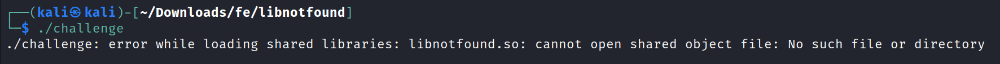

**3:** Hmm okay. Så titlen passer ret godt. Lad os prøve at køre command:
```
ldd ./challenge
```
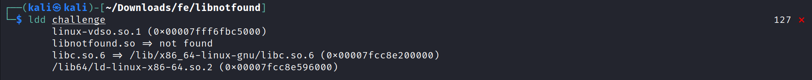

**4:** Så vi kan se at den mangler et libary ved navn libnotfound.so. **Jeg** prøvet først at fjerne libary med ["patchelf"](https://github.com/NixOS/patchelf). Meeen....
```
patchelf --remove-needed libnotfound.so ./challenge
```

**Men så fik jeg bare fejlen:**
```
./challenge: symbol lookup error: ./challenge: undefined symbol: foo_add
```

**5:** Så vi ved nu at vores binary file rent faktisk har behov for libary. Så lad os prøve at tage et kig på filen i Cutter.
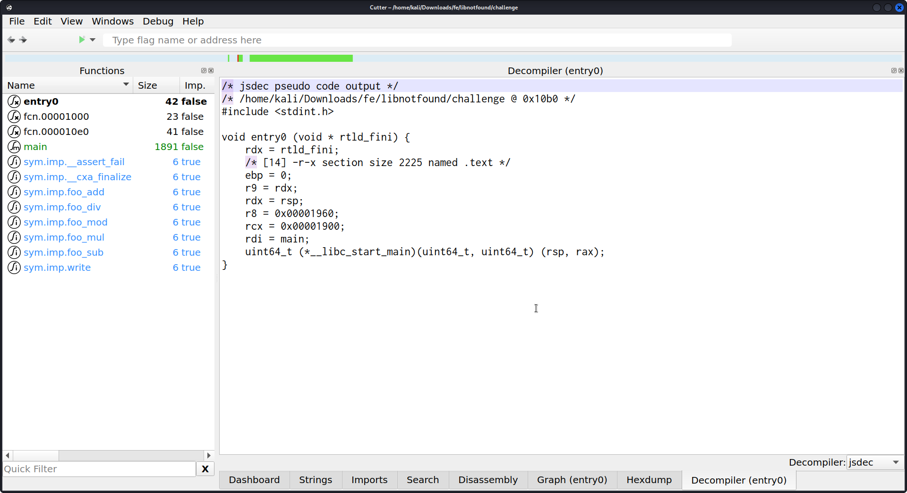

**6:** Vi kan se at der ude til venstre er nogle funktioner med følgene navne "foo_add", "foo_div", "foo_mod", "foo_mul", "foo_sub". Så gad vide om det ikke er dem der er i det mangle libary. Lad os tage et kig på dem.


**foo_add:**
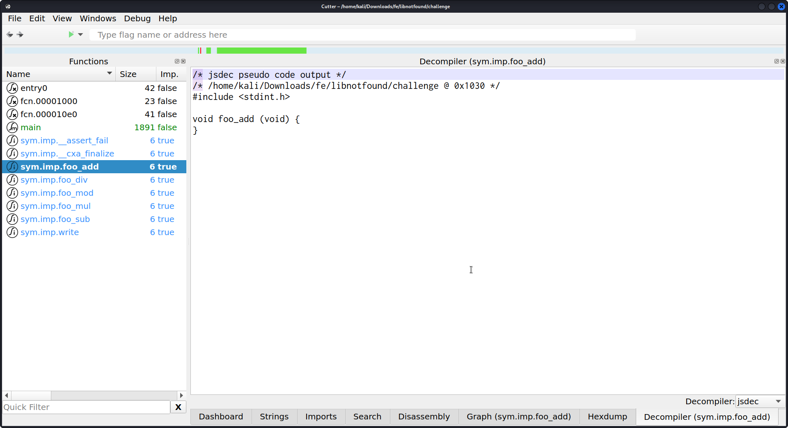

**foo_div:**
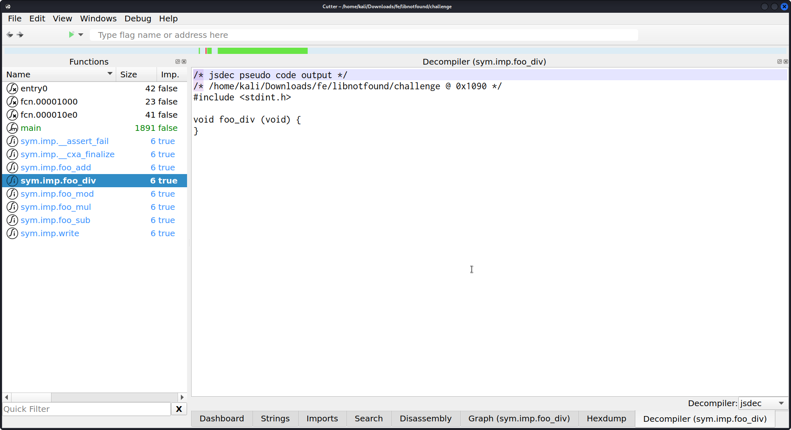

**foo_mod:**
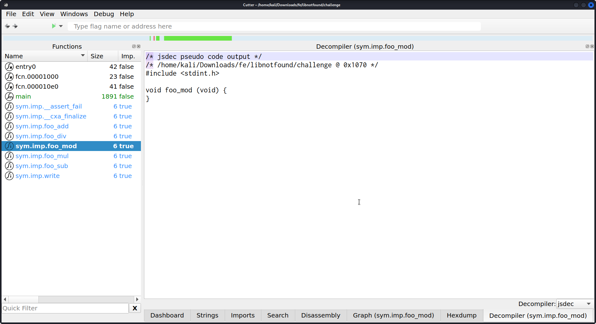

**foo_mul:**
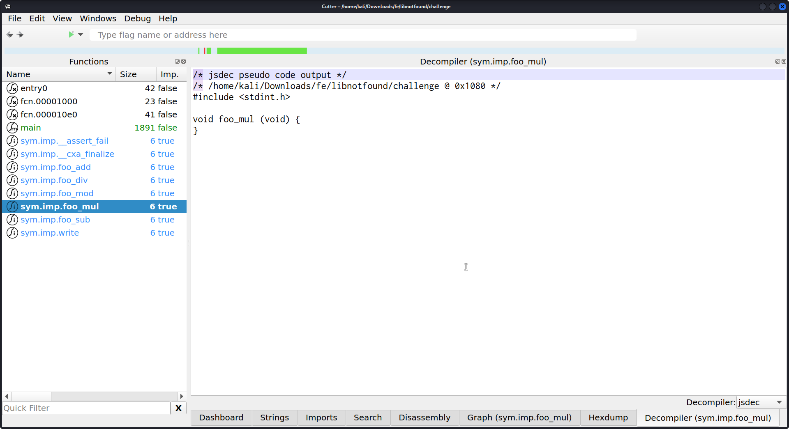

**foo_sub:**
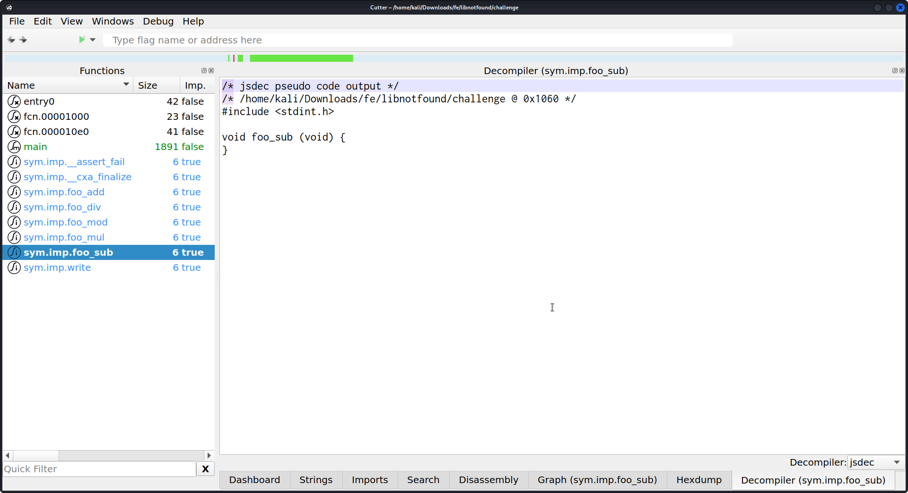

**7:** Hmm okay det gav os ikke særlig meget. Men gad vide om de forskellige forkortelser bag ve "foo\_" ikke står for de forskellige regne metoder. så altså.

foo_add = foo_add som i "a + b".

foo_div = foo_divide som i "a / b".

foo_mod = foo_modulo som i "a % b".

foo_mul = foo\_ multiply som i "a \* b".

foo_sub = foo_subtract som i "a - b".

**8:** Lad os prøve at se om der er noget spænde inde i "Strings" i Cutter.
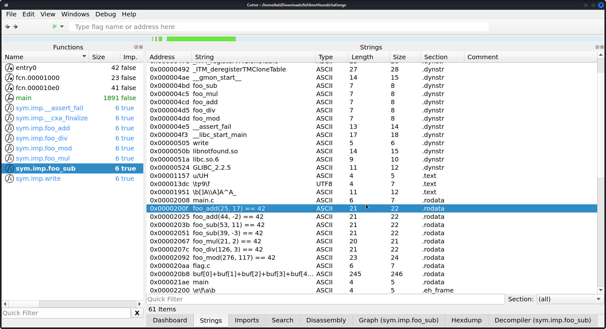

**9:** Vi ser at funktionerne modtager 2 argumenter. Så lad os begynde at lave vores egen libary, som skrives i  C.

**10:** Vi starter med at lave en file ved navn "foo_add.c". Som er den file hvor vores foo_add funktion skal være i.
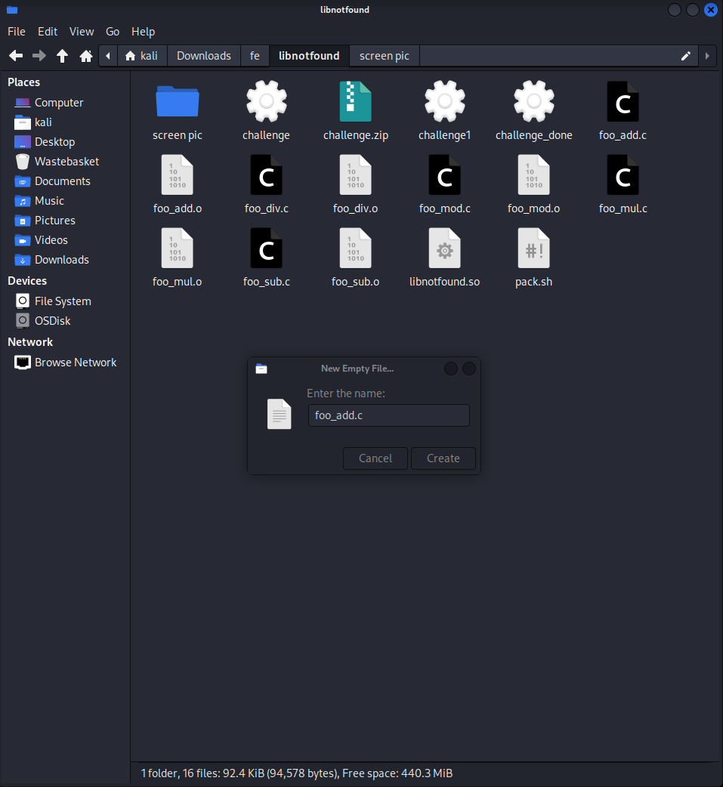

**11:** Vi skal nu selve lave funktionen som skal have avide hvad den skal return. Så derfor int. (Det er **kun** lige "foo_add" funktionen jeg kommer til at gå igennem meget grundigt.)
```
#include <stdio.h>
int foo_add()
{
 return;
} 
```

**12:** Nu skal vi så til at tilføje de argumenter, som vi fandt inde i "Strings" i "Cutter (punkt 7.)".
```
#include <stdio.h>
int foo_add(int a, int b)
{
 return;
} 
```

**13:** Som vores C kode ser ud lige nu, så vil den ikke return noget og den regner desuden heller ikke noget ud. Så lad os tilføje en variable som regner, de 2 inputs ud for os og derefter returnere det.
```
#include <stdio.h>
int foo_add(int a, int b)
{
 int c = a + b;
 return c;
}
```

**OBS.** Vis du downloade det kode jeg har lavet er der tilføjet "printf('\\n%d', c);" imellem "int c = a + b;" og  "return c;". Det er noget jeg har brugt i debug fasen og derfor behøver du det ikke.

**14:** Det samme skal så bare lige gøres med de 4 andre funktioner. Her er alle de andre funktioner. (**OBS.** Husk at oprette en ny file for hver gang der er en ny funktion.)

**foo_div:**
```
#include <stdio.h>
int foo_div(int a, int b)
{
 int c = a/b;
 return c;
}
```

**foo_mod:**
```
#include <stdio.h>
int foo_mod(int a, int b)
{
 int c = a % b;
 return c;
}
```

**foo_mul:**
```
#include <stdio.h>
int foo_mul(int a, int b)
{
 int c = a * b;
 return c;
}
```

**foo_sub:**
```
#include <stdio.h>
int foo_sub(int a, int b)
{
 int c = a - b;
 return c;
}
```

**15:** Nu når vi har lavet alle scriptene. Så skal vi lave dem om til .o filere. Det gøre vi ved at bruge "gcc" command. Jeg har inkulderet et script, som vil skrive alle de 5 commands for dig.
```
gcc -fPIC -g -c -Wall foo_sub.c
gcc -fPIC -g -c -Wall foo_add.c
gcc -fPIC -g -c -Wall foo_div.c
gcc -fPIC -g -c -Wall foo_mod.c
gcc -fPIC -g -c -Wall foo_mul.c
```

**16:** Nu har vi fået en masse .o filere. Som nu skal laves om til 1 .so file. Det gøre vi ved at bruge følgende command: 
```
gcc -shared -Wl,-soname,libnotfound.so -o libnotfound.so foo_add.o foo_div.o foo_mod.o foo_mul.o foo_sub.o -lc
```

**17:** Nu har vi en file der heder "libnotfound.so".

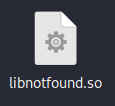

**18:** Men det er ikke helt nok, vi skal også lige fortælle den hvor den ligger hende. Det gøre vi ved at bruge "patchelf " igen. 
```
patchelf --set-rpath ./ ./libnotfound.so
```

**19:** Nu kan vi så først fjern "libnotfound.so" i vores binary file og derefter tilføje den vi lige har lavet. Det gøre vi ved at bruge "patchelf " igen. 

først fjerne vi libary:
```
patchelf --remove-needed libnotfound.so ./challenge
```

Så tilføjer vi vores egne libary:
```
patchelf --add-needed ./libnotfound.so ./challenge
```

**20:** Det eneste der så bare skal gøres nu er at run file.
```
./challenge
```

There we go. Så fik vi vores flag.

vigtige links:
<https://github.com/NixOS/patchelf>
