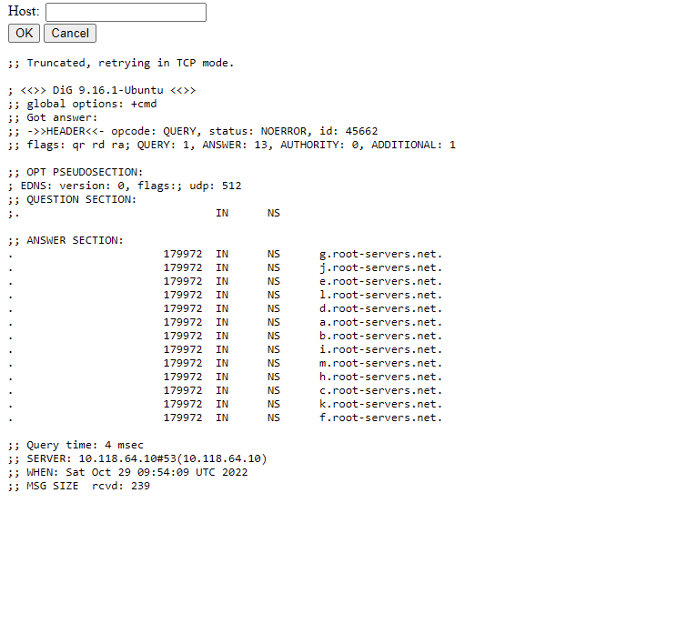

# Dig Host #1

Heard you like digging, so why not dig for some flags?

[dig-host-1-web.hack.fe-ctf.dk](http://dig-host-1-web.hack.fe-ctf.dk)

Det første man tænker er at man skal bruge værktøjet dig men i virkelig heder et det bar et coverup for at man først skal skrive dig command og derefter kan indputte hvilken som helst anden command man har lyst til

**1:**

**2:**

**3:**  Som man nok kan se er der umiddelbart ikke nogle flag her men gad vide om de ikke er i i folder tilbage

**4:** Jep der var den lad os se om vi ikke kan bruge cat commandoen til til at få adgang til den

**5:** Jep der var den

